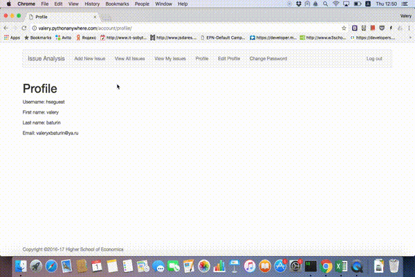

# Issue Analysis

Imagine you have a big problem to solve like image recognition or stock market prediction. There are several people in your company who solve the same problem inside the same team. And, of cource, you need to collaborate! This tool provides the easiest way to make the difference inside a project that you work on so hard. Easy to deploy, easy to use. So much profit!

# Usability Review and User Instruction
**1. Registration**

**2. Login**

**3. Add a new issue analysis**

**4. View added issue analysis**

**5. Logout**

**6. Reset password**

# What we have done

All the possible links collected here. Mention that some of them require login.

[Register](http://valery.pythonanywhere.com/account/register)

[Login](http://valery.pythonanywhere.com/account/login)

[Logout](http://valery.pythonanywhere.com/account/logout)

[Password Reset](http://valery.pythonanywhere.com/account/reset-password/)

[Profile](http://valery.pythonanywhere.com/account/profile)

[Edit Profile](http://valery.pythonanywhere.com/account/profile/edit/)

[Change Password](http://valery.pythonanywhere.com/account/change-password/)

[Add New Issue](http://valery.pythonanywhere.com/home/add)

[View All Issues](http://valery.pythonanywhere.com/home/all)

[View My issues](http://valery.pythonanywhere.com/home/my)

# If you are a developer

The code is avaliable and you can use it whatever purpose you have. Setup your own server with **issue analysis** project and understand how it works under the hood.

Our advice is to use virtualenv with django. So before you install requirments make sure you activated the env.

~~~~
$pip install virtualenv
virtualenv ENV_NAME
$source ENV_NAME/bin/activate
$git clone https://github.com/ValeryBaturin/issue_analysis
$pip install -r requirments.txt
$django manage.py runserver
~~~~
